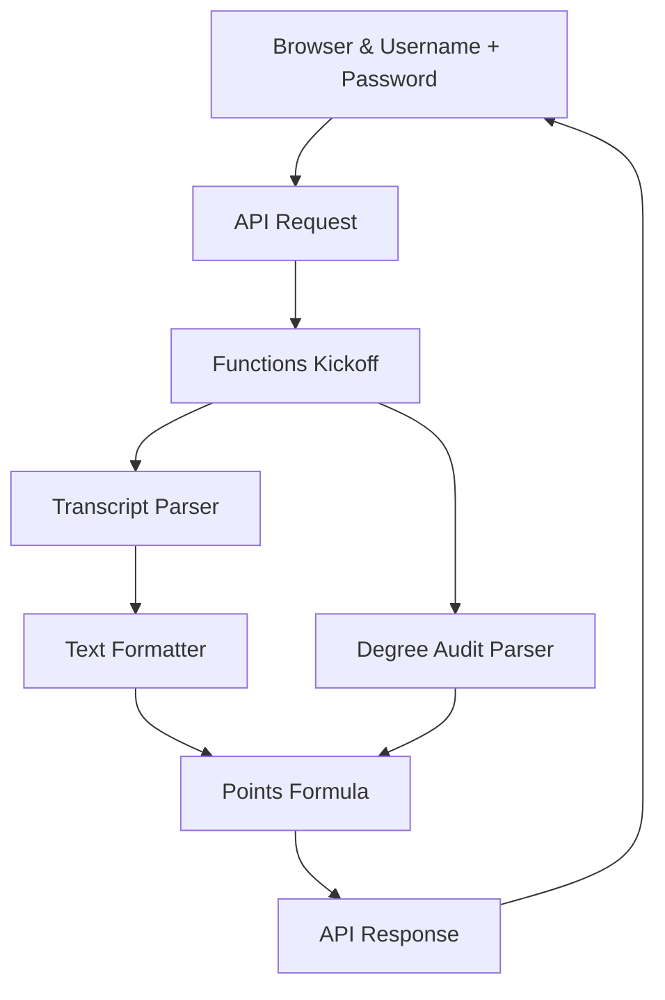

# Byte Me README 
---
###### Made By Calvin Schmeichel for "Byte Me" (Team 5) | SCSU Hackathon Fall 2023

### Table of Contents
---
[[Byte Me README#2. Introduction|1. Overview / TLDR]]
[[Byte Me README#1. Overview / TLDR|2. Introduction]]
[[Byte Me README#3. Demo|3. Demo]]
[[Byte Me README#4. Technologies|4. Technologies]]
[[Byte Me README#5. Looking Forward|5. Looking Forward]]
[[Byte Me README#6. Glossary|6. Glossary]]
[[Byte Me README#7. Contributors|7. Contributors]]
### 1. Overview / TLDR
---
- For our Fall 2023 Hackathon Project topic we chose web scrapping.
- All SCSU students have to take General Liberal Education courses. For many finding the right courses to take that make financial sense and are fun and appealing to the student can be hard. So we set out to fix it.
- Our *Solution* is to leverage Web Scraping to gather a students Degree Audit and Unofficial Transcript to figure out what classes the student has completed. To then use **our revolutionary in-house algorithm. Leveraging cutting-edge AI and machine learning techniques, we've crafted a state-of-the-art solution to optimize course schedules.** We then use this algorithm to generate a custom report for the student to help better plan their future semesters.
### 2. Introduction
---
The main problem is the lack of guidance and information of courses available to student's. It's sometimes unclear what classes provide more value to the student or what classes have a less favorable professor.

<p align="center">
  
</p>
**(Figure 1)** SCSU requires students to take classes from 10 Separate goal areas plus Diversity and Cultural requirements. The university conveniently hosts all of this information on their website. This is the foundation for our web scrapper.

#### Unofficial Transcript Example
##### Student Information
| Name             | John Doe          |
|------------------|-------------------|
| Student ID       | 123456789         |
| Major            | Computer Science  |
| Academic Advisor | Dr. Jane Smith    |
##### Academic Record
| Term       | Course Code | Course Title       | Credits | Grade |
|------------|-------------|--------------------|---------|-------|
| Fall 2019  | CS 101      | Intro to Computing | 4       | A     |
| Fall 2019  | MATH 150    | Calculus I         | 4       | B+    |
| Spring 2020| CS 102      | Data Structures    | 4       | A-    |
| Spring 2020| ENG 101     | English Composition| 3       | B     |
| Fall 2020  | CS 201      | Algorithms         | 4       | B+    |
| Fall 2020  | STAT 200    | Statistics         | 3       | A     |
| Spring 2021| CS 301      | Operating Systems  | 4       | A-    |
| Spring 2021| PHIL 105    | Ethics in Tech     | 3       | B+    |
##### Cumulative Information
| Total Credits Earned | 29    |
|----------------------|-------|
| Cumulative GPA       | 3.55  |

**Note:** This is an unofficial transcript.

#### Product Data Pipeline

*Sketch/Draft*

<p align="center">
  
</p>


*Final*


### 3. Demo
---
#### GIF 1 | Start StarID & Login 
*Sketch/Draft*
<p align="center">
  
</p>

```javascript
// Function to populate the accordion with data
// 
function populateAccordion(data) {
    const accordionContainer = document.getElementById('accordTemplate');

    Object.keys(data).forEach((mainCategory, mainIndex) => {
        let subAccordions = '';
        const mainAccordionId = `collapseMain${mainIndex}`;

        data[mainCategory].forEach((subCategoryObj) => {
            const subCategoryKey = Object.keys(subCategoryObj)[0];
            const subCategoryData = subCategoryObj[subCategoryKey];
            const subAccordionId = `collapseSub${mainIndex}${subCategoryKey.replace(
                /[^a-zA-Z0-9]/g,
                ''
            )}`;

            subAccordions += `
                <div class="accordion-item">
                    <h2 class="accordion-header" id="subHeading${subCategoryKey}${mainIndex}">
                        <button class="accordion-button collapsed" type="button" data-bs-toggle="collapse" data-bs-target="#${subAccordionId}" aria-expanded="false" aria-controls="${subAccordionId}">
                           ${subCategoryKey}
                        </button>
                    </h2>
                    <div id="${subAccordionId}" class="accordion-collapse collapse" aria-labelledby="subHeading${subCategoryKey}${mainIndex}">
                        <div class="accordion-body">
                            Goal: ${subCategoryData.join(', ')}
                        </div>
                    </div>
                </div>
            `;
        });

        const accordionItem = `
            <div class="accordion-item">
                <h2 class="accordion-header" id="heading${mainIndex}">
                    <button class="accordion-button collapsed" type="button" data-bs-toggle="collapse" data-bs-target="#${mainAccordionId}" aria-expanded="false" aria-controls="${mainAccordionId}">
                        Goal: ${mainCategory}
                    </button>
                </h2>
                <div id="${mainAccordionId}" class="accordion-collapse collapse" aria-labelledby="heading${mainIndex}">
                    <div class="accordion-body">
                        <div class="accordion" id="subAccordion${mainIndex}${mainCategory}">
                            ${subAccordions}
                        </div>
                    </div>
                </div>
            </div>
        `;

        accordionContainer.innerHTML += accordionItem;
    });
}
```

#### GIF 2 | Audit and Degree Map Scrape


#### GIF 3 | Data Parser
<p align="center">
  
</p>

##### Degree Audit Parser

```python
def findOptimalCourse(courses: dict, goalLeft: list, userNotCompleted: dict):
    hashMap = {}
    res = []

    for course in courses:
        points = 0
        goalFulfill = courses[course]
        for goals in goalLeft:
            if goals in goalFulfill:
                points += 1
        hashMap[course] = points

    hashMap = dict(sorted(hashMap.items(), key=lambda x: x[1], reverse=True))

    for key, val in hashMap.items():
        if val > 0:
            res.append(key)
    for i, key in enumerate(res):
        if key in courses:
            res[i] = {key: courses[key]}
    courseGoal = {}

    for key in res:
        for val in key.values():
            for item in val:
                if item in courseGoal:
                    courseGoal[item].append(key)
                else:
                    courseGoal[item] = [key]

    newDict = {}

    for key in goalLeft:
        newDict[f"{str(key)} {userNotCompleted[key]}"] = courseGoal[key]
    return json.dumps(newDict)
```

-  This function creates a list of optimal courses according to the goal areas hasn't fulfilled in descending order
	- :param courses: The json of all courses from the scraper
	- :type courses: dict
	- :param goalLeft: Goal areas the user needs to fulfill
	- :type goalLeft: list
	- :return: A json of all the optimal courses the user can take
	- :rtype: dict
##### Transcript Parser

```python
def GetDegreeAudit(DegreeAuditFile):
    with open(DegreeAuditFile, 'r') as file:
        file_contents = file.read()   
    CoursesTaken = file_contents.split()
    return(CoursesTaken)
```

- The `GetDegreeAudit` function gets the degree audit file name and opens the file for the program to read and save it to a string. It then splits the data by blank/white space and make a list and returns the saved list to main for further processing.

```python
def GetTakenCourses(CoursesTaken):
	courses = [["CYB"],["CSCI"], ["..."]

    flattened_courses = [item for sublist in courses for item in sublist]
    flattened_courses_lower = set(course.lower() for course in flattened_courses)

    filtered_words_with_next = []

    for i in range(len(CoursesTaken) - 1):
        word = CoursesTaken[i]
        if word.isupper() and word.lower() in flattened_courses_lower:
            filtered_words_with_next.append(word)
            filtered_words_with_next.append(CoursesTaken[i + 1])
    return(filtered_words_with_next)
```

- The `GetTakenCourses` function takes the newly generated list and cleans out all the "Garbage" data from the data scrap we don't need.

```python
def PrintToScreen(filtered_words_with_next):
    
    FinalList = []

    for n in range (0,len(filtered_words_with_next)-1, 2):
        FinalList.append(str(filtered_words_with_next[n])+str(filtered_words_with_next[n+1]))
    return(FinalList)
```

- The `PrintToScreen` function takes the newly cleaned and list and formats the final list in a standardized way for our other pythons scripts to process.
#### GIF 4 | Points System

```python
def findOptimalCourse(courses: dict, goalLeft: list):
    hashMap = {}
    res = []
    for course in courses:
        points = 0
        goalFulfill = courses[course]
        for goals in goalLeft:
            if goals in goalFulfill:
                points += 1
        hashMap[course] = points

    hashMap = dict(sorted(hashMap.items(), key=lambda x: x[1], reverse=True))

    for key, val in hashMap.items():
        if val > 0:
            res.append(key)

    return json.dumps({"optimalCourses": res})
```


The essence of the function can be represented by the equation:

$$ O = \max(\sum G_c) $$
Where:

- $O$ Represents the Optimal set of courses.
- $Gc$​ denotes the Goals fulfilled by course $c$.
- The summation $∑Gc$​ sums the goals fulfilled by each course.
- The max⁡ function selects the combination of courses that maximizes the total number of fulfilled goals.
- Once the class scores are fully calculated. The data is exported as a JSON.

#### GIF 5 | Display Data
### 4. Technologies
---
- [Python](https://www.python.org)
- [GitHub](https://github.com)
- [Obsidian](https://obsidian.md)
- Web-Scraping
	- [Undetected Chrome Driver](https://pypi.org/project/undetected-chromedriver/)
	- [Selenium](https://www.selenium.dev/documentation/webdriver/)
	- [Fast API](https://pypi.org/project/fastapi/)
- 
### 5. Looking Forward
---
**Business Aspect**

This product would add great value to students and SCSU as a whole. It would allow students to find more classes they will enjoy for a better value which in return would lead to better student retention at SCSU.

**Feasibility**

- This Product could be implemented directly into D2L or E-Services.
- Long-term we would want to grab this data directly from a database that SCSU host vs scraping the public web.
- In the long run this could be very profitable for the university.

**Future Works & Additions**

- Implement rate my professor to our Points System to add more data points to our generated report.
- Connect our product to e-services to gain access to class start times, dates and semester availability to provide a more detailed generated report.
- Expand our products scope to all Majors that are offered at SCSU. Not just General Liberal Education courses.
- Expand to all courses and implement a questionnaire/chatbot to help students gage what elective courses they might have interest in.
### 6. Glossary
---
### 7. Contributors
---
- [Abdinasir Mumin](https://github.com/AbdinasirM)
- [Brendan Chermack](https://github.com/BrendanChermack)
- [Calvin Schemeichel](https://github.com/Calvin-Schmeichel)
- [William Munnich](https://github.com/williammunnich)
- [Joshua Olaoye](https://github.com/joolaoye)
