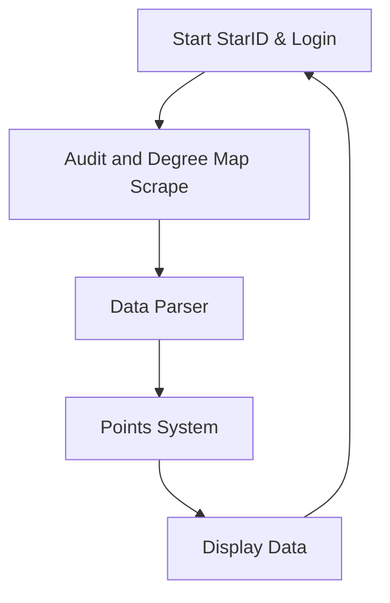

# Byte Me README 
---
###### Made By Calvin Schmeichel for "Byte Me" (Team 5) | SCSU Hackathon Fall 2023

### Table of Contents
---
### 1. Overview / TLDR
---
- For our Fall 2023 Hackathon Project topic we chose web scrapping.
- All SCSU students have to take General Liberal Education courses. For many finding the right courses to take that make financial sense and are fun and appealing to the student can be hard. So we set out to fix it.
- Our *Solution* is to leverage Web Scraping to gather a students Degree Audit and Unofficial Transcript to figure out what classes the student has completed. To then use **our revolutionary in-house algorithm. Leveraging cutting-edge AI and machine learning techniques, we've crafted a state-of-the-art solution to optimize course schedules.** We then use this algorithm to generate a custom report for the student to help better plan their future semesters.
### 2. Introduction
---
The main problem is the lack of guidance and information of courses available to student's. It's sometimes unclear what classes provide more value to the student or what classes have a less favorable professor.

<p align="center">
  
</p>
(Figure 1) SCSU requires students to take classes from 10 Separate goal areas plus Diversity and Cultural requirements. The university conveniently hosts all of this information on their website. This is the foundation for our web scrapper.

#### Unofficial Transcript Example
##### Student Information
| Name             | John Doe          |
|------------------|-------------------|
| Student ID       | 123456789         |
| Major            | Computer Science  |
| Academic Advisor | Dr. Jane Smith    |
##### Academic Record
| Term       | Course Code | Course Title       | Credits | Grade |
|------------|-------------|--------------------|---------|-------|
| Fall 2019  | CS 101      | Intro to Computing | 4       | A     |
| Fall 2019  | MATH 150    | Calculus I         | 4       | B+    |
| Spring 2020| CS 102      | Data Structures    | 4       | A-    |
| Spring 2020| ENG 101     | English Composition| 3       | B     |
| Fall 2020  | CS 201      | Algorithms         | 4       | B+    |
| Fall 2020  | STAT 200    | Statistics         | 3       | A     |
| Spring 2021| CS 301      | Operating Systems  | 4       | A-    |
| Spring 2021| PHIL 105    | Ethics in Tech     | 3       | B+    |
##### Cumulative Information
| Total Credits Earned | 29    |
|----------------------|-------|
| Cumulative GPA       | 3.55  |

**Note:** This is an unofficial transcript.

### 3. Demo
---
#### GIF 1 | Start StarID & Login 
<p align="center">
  
</p>
#### GIF 2 | Audit and Degree Map Scrape

#### GIF 3 | Data Parser
<p align="center">
  
</p>


#### GIF 4 | Points System

```python
def findOptimalCourse(courses: dict, goalLeft: list):
    hashMap = {}
    res = []
    for course in courses:
        points = 0
        goalFulfill = courses[course]
        for goals in goalLeft:
            if goals in goalFulfill:
                points += 1
        hashMap[course] = points

    hashMap = dict(sorted(hashMap.items(), key=lambda x: x[1], reverse=True))

    for key, val in hashMap.items():
        if val > 0:
            res.append(key)

    return json.dumps({"optimalCourses": res})
```


The essence of the function can be represented by the equation:

$$O = \max(\sum G_c)$$

Where:
- $O$ Represents the Optimal set of courses.
- $GcGc$​ denotes the Goals fulfilled by course cc.
- The summation $∑Gc$​ sums the goals fulfilled by each course.
- The max⁡ function selects the combination of courses that maximizes the total number of fulfilled goals.

#### GIF 5 | Display Data
### 4. Technologies
---
### 5. Looking Forward
---
### 6. Glossary
---
### 7. Contributors
---
Abdinasir Mumin
Brendan Chermack
Calvin Schemeichal
William Munnich
Josh



